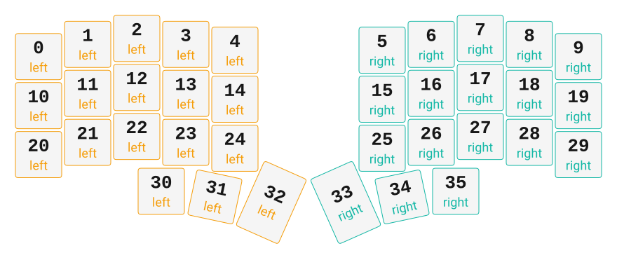

# ZMK Configuration for Bung

*Generated by Shield Wizard for ZMK*



Download compiled firmware from the Actions tab. <https://zmk.dev/docs/user-setup#installing-the-firmware>

Edit your keymap <https://zmk.dev/docs/keymaps>.
User keymap is located at [`config/bung.keymap`](config/bung.keymap).

-----

<details>
<summary>
Shield Wizard Debug Information
</summary>

In case of broken configuration, here is the Shield Wizard internal data used to generate this configuration:

Commit: 63ab9b7bd8845252979f45da72f40210b0b1a3ae

```json
{"name":"Bung","shield":"bung","dongle":false,"modules":[],"layout":[{"id":"01KSYXNDFSEG12JZ5GWEQNQSQH","part":0,"row":0,"col":0,"w":1,"h":1,"x":0,"y":0.37,"r":0,"rx":0,"ry":0},{"id":"01KSYXNDFSYC6RNSWZ6C8KGPYB","part":0,"row":0,"col":1,"w":1,"h":1,"x":1,"y":0.12,"r":0,"rx":0,"ry":0},{"id":"01KSYXNDFS9ZC3CA4QTV4JDSYG","part":0,"row":0,"col":2,"w":1,"h":1,"x":2,"y":0,"r":0,"rx":0,"ry":0},{"id":"01KSYXNDFS1XDWYGQTVRYJ3PMK","part":0,"row":0,"col":3,"w":1,"h":1,"x":3,"y":0.12,"r":0,"rx":0,"ry":0},{"id":"01KSYXNDFS8X4T3N6JYG7PQRAF","part":0,"row":0,"col":4,"w":1,"h":1,"x":4,"y":0.24,"r":0,"rx":0,"ry":0},{"id":"01KSYXNDFS5EXRR2ZN8FTEFK9W","part":1,"row":0,"col":5,"w":1,"h":1,"x":7,"y":0.24,"r":0,"rx":0,"ry":0},{"id":"01KSYXNDFSJJXJKKVG4XAQJ3P1","part":1,"row":0,"col":6,"w":1,"h":1,"x":8,"y":0.12,"r":0,"rx":0,"ry":0},{"id":"01KSYXNDFS0C8T772EP9SDWX4G","part":1,"row":0,"col":7,"w":1,"h":1,"x":9,"y":0,"r":0,"rx":0,"ry":0},{"id":"01KSYXNDFS16JZAH325QM5RQEK","part":1,"row":0,"col":8,"w":1,"h":1,"x":10,"y":0.12,"r":0,"rx":0,"ry":0},{"id":"01KSYXNDFS5ZKD0BFG84Y8AP7Z","part":1,"row":0,"col":9,"w":1,"h":1,"x":11,"y":0.37,"r":0,"rx":0,"ry":0},{"id":"01KSYXNDFSNRAZ90QSY8GT1HS8","part":0,"row":1,"col":0,"w":1,"h":1,"x":0,"y":1.37,"r":0,"rx":0,"ry":0},{"id":"01KSYXNDFSB2J9G29A766WWGTY","part":0,"row":1,"col":1,"w":1,"h":1,"x":1,"y":1.12,"r":0,"rx":0,"ry":0},{"id":"01KSYXNDFSJBNMDGKTTFD6PKZE","part":0,"row":1,"col":2,"w":1,"h":1,"x":2,"y":1,"r":0,"rx":0,"ry":0},{"id":"01KSYXNDFSJ2NA14S1BSHJ2V6E","part":0,"row":1,"col":3,"w":1,"h":1,"x":3,"y":1.12,"r":0,"rx":0,"ry":0},{"id":"01KSYXNDFS3QTEMCBD0TE9B5DY","part":0,"row":1,"col":4,"w":1,"h":1,"x":4,"y":1.24,"r":0,"rx":0,"ry":0},{"id":"01KSYXNDFSKBY0ZC3Z4TMCHXCS","part":1,"row":1,"col":5,"w":1,"h":1,"x":7,"y":1.24,"r":0,"rx":0,"ry":0},{"id":"01KSYXNDFSAKSHKR8936NCD67J","part":1,"row":1,"col":6,"w":1,"h":1,"x":8,"y":1.12,"r":0,"rx":0,"ry":0},{"id":"01KSYXNDFS9Q5CCY4QAVD40WP9","part":1,"row":1,"col":7,"w":1,"h":1,"x":9,"y":1,"r":0,"rx":0,"ry":0},{"id":"01KSYXNDFS2VYHS83JQ4MKFWYS","part":1,"row":1,"col":8,"w":1,"h":1,"x":10,"y":1.12,"r":0,"rx":0,"ry":0},{"id":"01KSYXNDFS5PSNN15EYBKBDF9P","part":1,"row":1,"col":9,"w":1,"h":1,"x":11,"y":1.37,"r":0,"rx":0,"ry":0},{"id":"01KSYXNDFS1PY4ZW4N459Q3JHX","part":0,"row":2,"col":0,"w":1,"h":1,"x":0,"y":2.37,"r":0,"rx":0,"ry":0},{"id":"01KSYXNDFSYVDKX0ARN4T9CXX1","part":0,"row":2,"col":1,"w":1,"h":1,"x":1,"y":2.12,"r":0,"rx":0,"ry":0},{"id":"01KSYXNDFS6756Y5YY1JHZG42F","part":0,"row":2,"col":2,"w":1,"h":1,"x":2,"y":2,"r":0,"rx":0,"ry":0},{"id":"01KSYXNDFS0S6YMF0YSCDRA7S5","part":0,"row":2,"col":3,"w":1,"h":1,"x":3,"y":2.12,"r":0,"rx":0,"ry":0},{"id":"01KSYXNDFS7HQ433ZVES0227WH","part":0,"row":2,"col":4,"w":1,"h":1,"x":4,"y":2.24,"r":0,"rx":0,"ry":0},{"id":"01KSYXNDFSNK71D0NNDN273VWC","part":1,"row":2,"col":5,"w":1,"h":1,"x":7,"y":2.24,"r":0,"rx":0,"ry":0},{"id":"01KSYXNDFS8JHS06YCWKHF92JT","part":1,"row":2,"col":6,"w":1,"h":1,"x":8,"y":2.12,"r":0,"rx":0,"ry":0},{"id":"01KSYXNDFSZ3KC6D7SE4NYZYF1","part":1,"row":2,"col":7,"w":1,"h":1,"x":9,"y":2,"r":0,"rx":0,"ry":0},{"id":"01KSYXNDFS1ZYRHEZYDWK1EC70","part":1,"row":2,"col":8,"w":1,"h":1,"x":10,"y":2.12,"r":0,"rx":0,"ry":0},{"id":"01KSYXNDFS9XTRTH3KVC7E3YTA","part":1,"row":2,"col":9,"w":1,"h":1,"x":11,"y":2.37,"r":0,"rx":0,"ry":0},{"id":"01KSYXNDFSE5N3F81Y6WJ0S5YW","part":0,"row":3,"col":2,"w":1,"h":1,"x":2.5,"y":3.12,"r":0,"rx":0,"ry":0},{"id":"01KSYXNDFS53QY7PRDY5MGZ68S","part":0,"row":3,"col":3,"w":1,"h":1,"x":3.5,"y":3.12,"r":12,"rx":3.5,"ry":4.12},{"id":"01KSYXNDFS09DHD2SFZXXZKY0A","part":0,"row":3,"col":4,"w":1,"h":1.5,"x":4.48,"y":2.83,"r":24,"rx":4.48,"ry":4.33},{"id":"01KSYXNDFSE90V7YAD682NC7A1","part":1,"row":3,"col":5,"w":1,"h":1.5,"x":6.52,"y":2.83,"r":-24,"rx":7.52,"ry":4.33},{"id":"01KSYXNDFS14JJ8KX3STAGCJ70","part":1,"row":3,"col":6,"w":1,"h":1,"x":7.5,"y":3.12,"r":-12,"rx":8.5,"ry":4.12},{"id":"01KSYXNDFSE0PVG5G22C0787Y0","part":1,"row":3,"col":7,"w":1,"h":1,"x":8.5,"y":3.12,"r":0,"rx":0,"ry":0}],"parts":[{"name":"left","controller":"nice_nano_v2","wiring":"matrix_diode","pins":{"d2":"input","d3":"input","d4":"input","d5":"input","d7":"output","d8":"output","d9":"output","d6":"output","d0":"input"},"keys":{"01KSYXNDFSEG12JZ5GWEQNQSQH":{"input":"d0","output":"d6"},"01KSYXNDFSNRAZ90QSY8GT1HS8":{"input":"d0","output":"d7"},"01KSYXNDFS1PY4ZW4N459Q3JHX":{"input":"d0","output":"d8"},"01KSYXNDFSYC6RNSWZ6C8KGPYB":{"input":"d2","output":"d6"},"01KSYXNDFSB2J9G29A766WWGTY":{"input":"d2","output":"d7"},"01KSYXNDFSYVDKX0ARN4T9CXX1":{"input":"d2","output":"d8"},"01KSYXNDFS9ZC3CA4QTV4JDSYG":{"input":"d3","output":"d6"},"01KSYXNDFSJBNMDGKTTFD6PKZE":{"input":"d3","output":"d7"},"01KSYXNDFS6756Y5YY1JHZG42F":{"input":"d3","output":"d8"},"01KSYXNDFSE5N3F81Y6WJ0S5YW":{"input":"d3","output":"d9"},"01KSYXNDFS1XDWYGQTVRYJ3PMK":{"input":"d4","output":"d6"},"01KSYXNDFSJ2NA14S1BSHJ2V6E":{"input":"d4","output":"d7"},"01KSYXNDFS0S6YMF0YSCDRA7S5":{"input":"d4","output":"d8"},"01KSYXNDFS53QY7PRDY5MGZ68S":{"input":"d4","output":"d9"},"01KSYXNDFS8X4T3N6JYG7PQRAF":{"input":"d5","output":"d6"},"01KSYXNDFS3QTEMCBD0TE9B5DY":{"input":"d5","output":"d7"},"01KSYXNDFS7HQ433ZVES0227WH":{"input":"d5","output":"d8"},"01KSYXNDFS09DHD2SFZXXZKY0A":{"input":"d5","output":"d9"}},"encoders":[],"buses":[{"name":"spi0","devices":[],"type":"spi"},{"name":"spi1","devices":[],"type":"spi"},{"name":"spi2","devices":[],"type":"spi"},{"name":"spi3","devices":[],"type":"spi"},{"name":"i2c0","devices":[],"type":"i2c"},{"name":"i2c1","devices":[],"type":"i2c"}]},{"name":"right","controller":"nice_nano_v2","wiring":"matrix_diode","pins":{"d0":"input","d21":"input","d20":"input","d19":"input","d18":"input","d15":"output","d14":"output","d16":"output","d10":"output"},"keys":{"01KSYXNDFS5ZKD0BFG84Y8AP7Z":{"input":"d0","output":"d15"},"01KSYXNDFS5PSNN15EYBKBDF9P":{"input":"d0","output":"d14"},"01KSYXNDFS9XTRTH3KVC7E3YTA":{"input":"d0","output":"d16"},"01KSYXNDFS16JZAH325QM5RQEK":{"input":"d21","output":"d15"},"01KSYXNDFS2VYHS83JQ4MKFWYS":{"input":"d21","output":"d14"},"01KSYXNDFS1ZYRHEZYDWK1EC70":{"input":"d21","output":"d16"},"01KSYXNDFS0C8T772EP9SDWX4G":{"input":"d20","output":"d15"},"01KSYXNDFS9Q5CCY4QAVD40WP9":{"input":"d20","output":"d14"},"01KSYXNDFSZ3KC6D7SE4NYZYF1":{"input":"d20","output":"d16"},"01KSYXNDFSE0PVG5G22C0787Y0":{"input":"d20","output":"d10"},"01KSYXNDFSJJXJKKVG4XAQJ3P1":{"input":"d19","output":"d15"},"01KSYXNDFSAKSHKR8936NCD67J":{"input":"d19","output":"d14"},"01KSYXNDFS8JHS06YCWKHF92JT":{"input":"d19","output":"d16"},"01KSYXNDFS14JJ8KX3STAGCJ70":{"input":"d19","output":"d10"},"01KSYXNDFS5EXRR2ZN8FTEFK9W":{"input":"d18","output":"d15"},"01KSYXNDFSKBY0ZC3Z4TMCHXCS":{"input":"d18","output":"d14"},"01KSYXNDFSNK71D0NNDN273VWC":{"input":"d18","output":"d16"},"01KSYXNDFSE90V7YAD682NC7A1":{"input":"d18","output":"d10"}},"encoders":[],"buses":[{"name":"spi0","devices":[],"type":"spi"},{"name":"spi1","devices":[],"type":"spi"},{"name":"spi2","devices":[],"type":"spi"},{"name":"spi3","devices":[],"type":"spi"},{"name":"i2c0","devices":[],"type":"i2c"},{"name":"i2c1","devices":[],"type":"i2c"}]}]}
```

</details>
